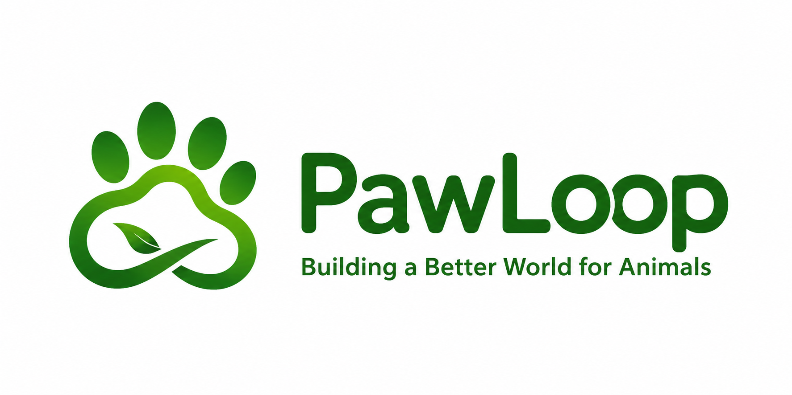

<div align="center">
  
  
  <br />
  
  <h3>Urban Ecosystem Operating System</h3>
  
  <p align="center">
    A real-time, community-driven platform for managing urban wildlife ecosystems, tracking resources, and coordinating volunteer missions.
  </p>

  <p align="center">
    <a href="https://nextjs.org/"></a>
    <a href="https://supabase.com/"></a>
    <a href="https://www.typescriptlang.org/"></a>
    <a href="https://tailwindcss.com/"></a>
  </p>
</div>

---


## 📖 Table of Contents

- [About the Project](#-about-the-project)
- [Key Features](#-key-features)
- [Tech Stack](#-tech-stack)
- [System Architecture](#-system-architecture)
- [Getting Started](#-getting-started)
- [Documentation](#-documentation)
- [Contributing](#-contributing)
- [License](#-license)

## 🐾 About the Project

**PawLoop** is an advanced, offline-capable digital ecosystem designed to bridge the gap between urban infrastructure and wildlife welfare. By utilizing an interactive map and realtime telemetry, the platform empowers community volunteers to monitor feeding stations, track water resources, and rapidly respond to animal emergencies.

PawLoop leverages a **Narrative Intelligence Engine** to turn routine volunteer work into engaging, gamified community stories, boosting retention and ecosystem impact.

## ✨ Key Features

- 🗺️ **Live Map Interface**: Real-time Leaflet integration visualizing all ecosystem nodes (stations, reports, volunteers).
- 💧 **Resource Tracking**: Monitor and maintain critical infrastructure like water bowls and feeding stations.
- 🚨 **Emergency Reporting**: Rapid alert system for animals in distress or missing resources.
- 🎮 **Gamified Volunteer Missions**: Dynamically assigned, proximity-based tasks for community engagement.
- 🧠 **Narrative Intelligence**: Generative AI-driven stories based on community impact and completed missions.
- 📶 **Offline-First Architecture**: Robust IndexedDB queuing ensures functionality in patchy network environments.
- 📊 **Command Center**: Global view, realtime metrics, and ecosystem health dashboards for administrators.
- 🔔 **Push Notifications**: PWA-ready web push subscriptions for critical alerts.

## 🛠 Tech Stack

PawLoop is built with modern web technologies prioritizing speed, reactivity, and edge-deployability.

* **Frontend Framework**: Next.js (App Router)
* **UI Library**: React 18
* **Language**: TypeScript
* **Styling**: TailwindCSS & Lucide Icons
* **Maps**: Leaflet (via `react-leaflet`)
* **Backend as a Service**: Supabase
* **Database**: PostgreSQL
* **Realtime**: Supabase WebSockets

## 🏗 System Architecture

PawLoop relies on a reactive, event-driven architecture. For a deep dive into the infrastructure, data flow, and the predictive Digital Twin engine, view our detailed architecture documentation.

> 👉 **[Read the full Architecture Guide](./ARCHITECTURE.md)**


## 🚀 Getting Started

To get a local copy up and running, follow these simple steps.

### Prerequisites

* Node.js (v18+)
* npm or pnpm
* A Supabase project

### Installation

1. **Clone the repo**
   ```bash
   git clone https://github.com/yourusername/pawloop.git
   cd pawloop
   ```

2. **Install NPM packages**
   ```bash
   npm install
   ```

3. **Configure Environment Variables**  
   Create a `.env.local` file in the root directory and add your Supabase credentials:
   ```env
   NEXT_PUBLIC_SUPABASE_URL=your_supabase_project_url
   NEXT_PUBLIC_SUPABASE_ANON_KEY=your_supabase_anon_key
   ```
   *(Optional)* For Push Notifications:
   ```env
   NEXT_PUBLIC_VAPID_PUBLIC_KEY=your_vapid_public_key
   VAPID_PRIVATE_KEY=your_vapid_private_key
   ```

4. **Run the development server**
   ```bash
   npm run dev
   ```
   The application will be available at `http://localhost:3000`.

## 📚 Documentation

Detailed documentation is available in the repository to help you understand the core systems:

- **[Deployment Guide](./DEPLOYMENT.md)** - Instructions for deploying to Vercel and configuring production environments.
- **[Database Schema](./DATABASE.md)** - Comprehensive breakdown of tables, relations, and the ecosystem data model.
- **[Architecture](./ARCHITECTURE.md)** - Core systems, edge functions, and offline-sync workflows.

## 🤝 Contributing

Contributions are what make the open-source community such an amazing place to learn, inspire, and create. Any contributions you make are **greatly appreciated**.

1. Fork the Project
2. Create your Feature Branch (`git checkout -b feature/AmazingFeature`)
3. Commit your Changes (`git commit -m 'Add some AmazingFeature'`)
4. Push to the Branch (`git push origin feature/AmazingFeature`)
5. Open a Pull Request

## 📄 License

Distributed under the MIT License. See `LICENSE` for more information.

---
<p align="center">
  Built with ❤️ for urban wildlife.
</p>
